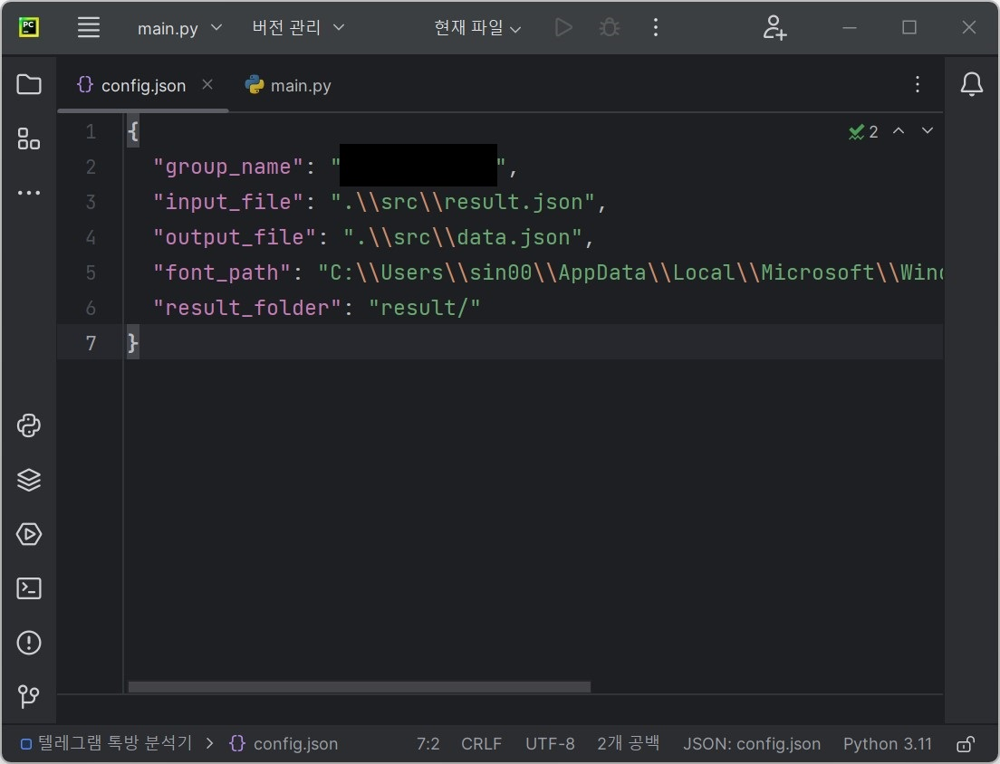
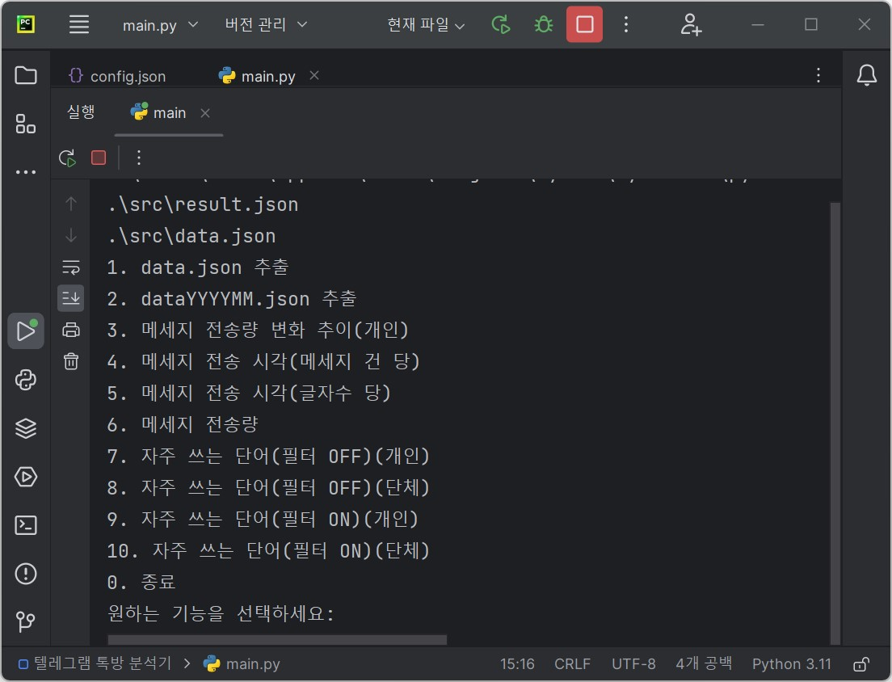
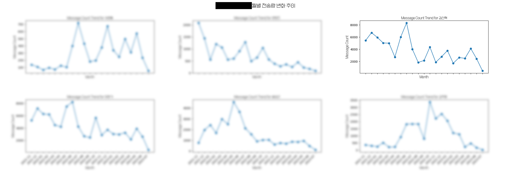
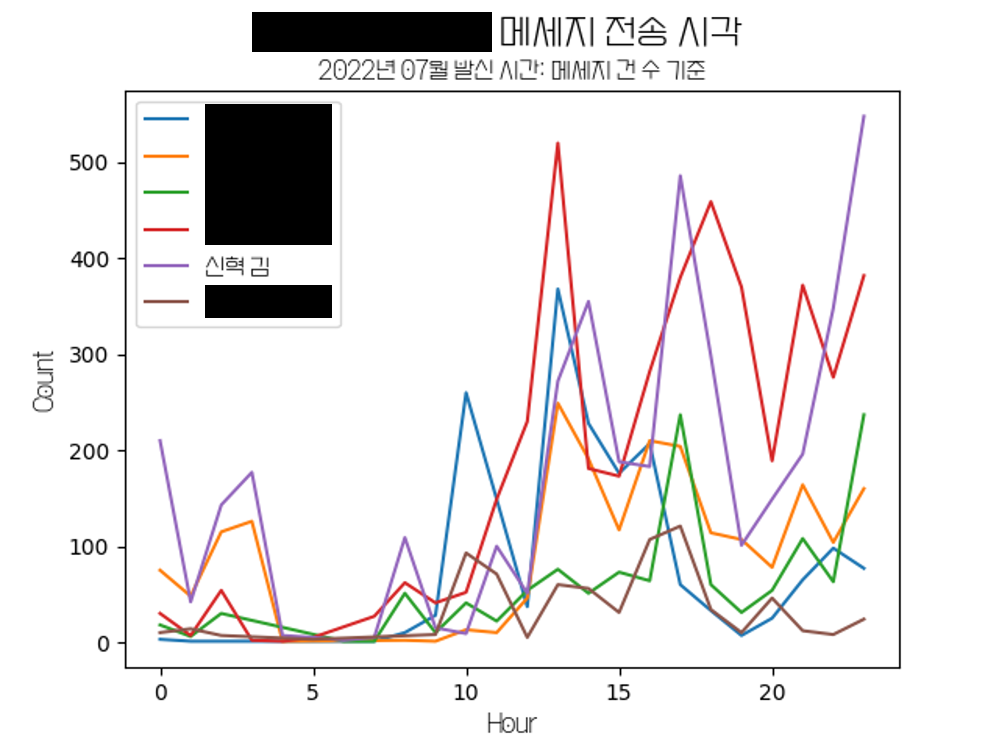
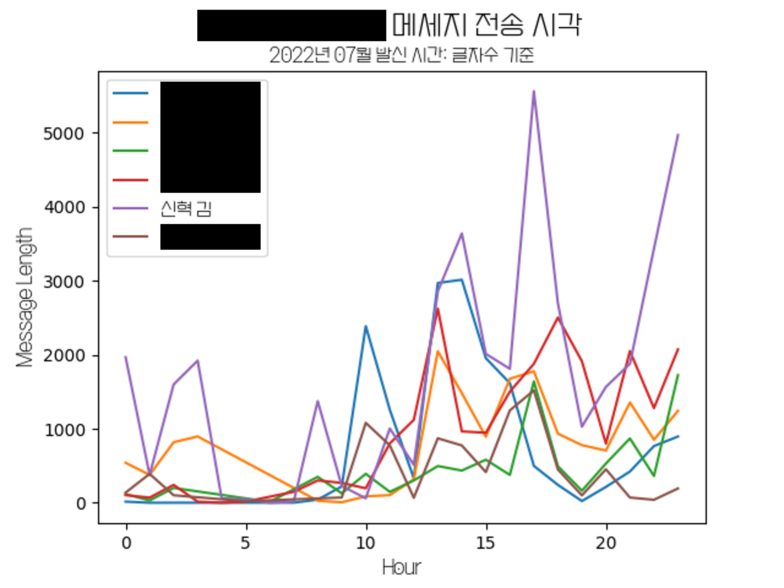
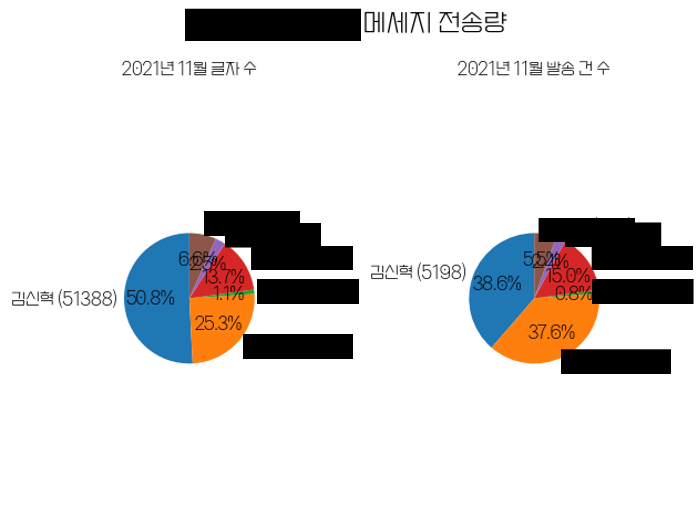

## 📚 Statistics Chatting

톡방 통계 프로그램입니다.  
현재 텔레그램만 지원합니다.

|config.json|
| :--: |
| </img> |
|적절하게 수정합니다.|

|main.py 실행 화면|
| :--: |
| </img> |
|원하는 기능에 맞는 숫자를 입력합니다.|

|메세지 전송량 변화 추이(개인)|
| :--: |
| </img> |

|메세지 전송 시각(메세지 건 당)|
| :--: |
| </img> |

|메세지 전송 시각(글자 수)|
| :--: |
| </img> |

|메세지 전송량|
| :--: |
| </img> |

|자주 쓰는 단어(필터 OFF)(개인)|
| :--: |
| </img> |

|자주 쓰는 단어(필터 OFF)(단체)|
| :--: |
| </img> |

|자주 쓰는 단어(필터 ON)(개인)|
| :--: |
| </img> |

|자주 쓰는 단어(필터 ON)(단체)|
| :--: |
| </img> |

## 📚 개발 환경

> OS; Operating System  
>  
>
> > 
---

> IDE; Integrated Development Environment  
>  
>
> > 

---

> Programming Languages  
>  
>
> > 
