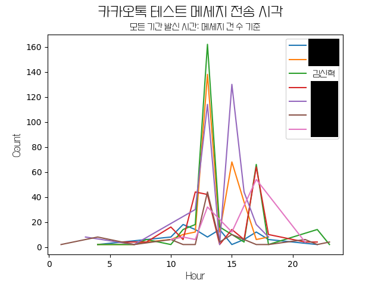
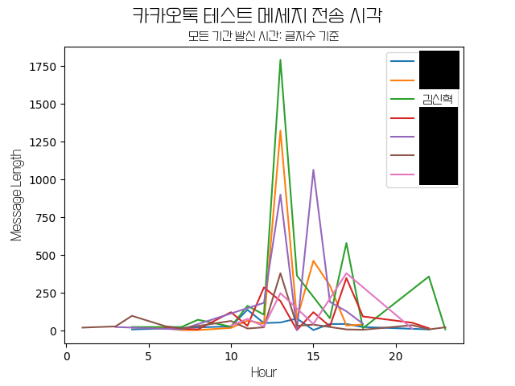
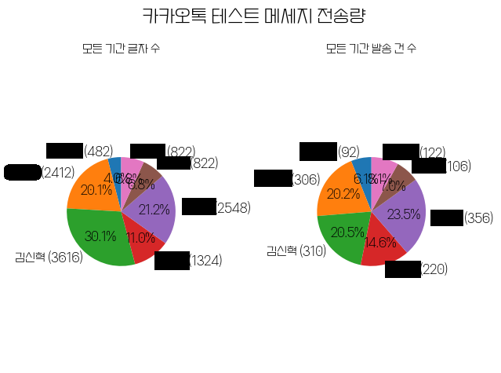

## 📚 톡방 통계 프로그램

톡방 통계 프로그램입니다.  
현재 텔레그램, 카카오톡 지원합니다.

    
📁 사용법

|                                     config.json 설정                                     |
| :--------------------------------------------------------------------------------------: |
| </img> |
|                     group_name, font_path만 수정하는걸 추천드립니다.                     |

|                                       main.py 실행                                       |
| :--------------------------------------------------------------------------------------: |
| </img> |
|             추출한 데이터가 없다면 1번을 입력하여 데이터 추출부터 진행하세요             |

|                                       main.py 실행                                       |
| :--------------------------------------------------------------------------------------: |
| </img> |
|                 추출한 플랫폼에 맞춰 두 가지 형태의 데이터를 추출하세요.                 |

|                                          기능 실행                                           |
| :------------------------------------------------------------------------------------------: |
| </img> |
|                            all을 입력하면 모든 기간을 분석합니다.                            |

|                                           기능 실행                                           |
| :-------------------------------------------------------------------------------------------: |
| </img> |
|                            기간을 입력하면 해당 기간을 분석합니다.                            |

|                                        기능 실행                                         |
| :--------------------------------------------------------------------------------------: |
| </img> |
|                    결과는 result 폴더 안에 이미지 파일로 저장됩니다.                     |

|                        메세지 전송량 변화 추이(개인)                        |
| :-------------------------------------------------------------------------: |
| </img> |

|                       메세지 전송 시각(메세지 건 당)                        |                                                                                 |
| :-------------------------------------------------------------------------: | :-----------------------------------------------------------------------------: |
| </img> | </img> |

|                          메세지 전송 시각(글자 수)                          |                                                                                 |
| :-------------------------------------------------------------------------: | :-----------------------------------------------------------------------------: |
| </img> | </img> |

|                                메세지 전송량                                |                                                                                 |
| :-------------------------------------------------------------------------: | :-----------------------------------------------------------------------------: |
| </img> | </img> |

|                       자주 쓰는 단어(필터 OFF)(개인)                        |
| :-------------------------------------------------------------------------: |
| </img> |

|                       자주 쓰는 단어(필터 OFF)(단체)                        |                                                                                 |
| :-------------------------------------------------------------------------: | :-----------------------------------------------------------------------------: |
| </img> | </img> |

|                        자주 쓰는 단어(필터 ON)(개인)                        |
| :-------------------------------------------------------------------------: |
| </img> |

|                         자주 쓰는 단어(필터 ON)(단체)                         |                                                                                   |
| :---------------------------------------------------------------------------: | :-------------------------------------------------------------------------------: |
| </img> | </img> |

|                            채팅방 데이터 뽑는 방법                            |                                |
| :---------------------------------------------------------------------------: | :----------------------------: |
| </img> | 대화 내보내기를 찾아 해보세요. |
|                                   텔레그램                                    |            카카오톡            |

## 📚 개발 환경

> OS; Operating System  
>  
>
> > 

---

> IDE; Integrated Development Environment  
>  
>
> > 

---

> Programming Languages  
>  
>
> > 
